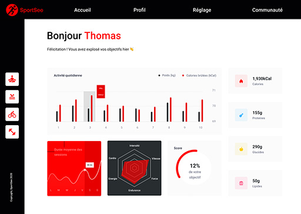
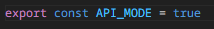

# SportSee

Welcome to the SportSee-fullApp repository! 👋
This repository contains the full application code for SportSee, a comprehensive fitness tracking and analysis platform that uses [Recharts](#https://recharts.org/en-US/) to visually display the user's data regarding their fitness condition. SportSee allows users to track their physical activities, monitor their fitness progress, and gain valuable insights into their health and performance.

## Table of Contents

### [Introduction](#introduction)
### [Features](#features)
### [Installation](#installation)

## Introduction

SportSee is designed to provide a holistic view of an individual's fitness journey.

This repository contains the complete codebase for the SportSee application, including both the front-end and back-end components. The front-end is built with React, while the back-end is powered by [Node.js](#https://nodejs.org/en) and [Express.js](#https://expressjs.com/). The application uses a RESTful API to communicate between the front-end and back-end.

> The frontend has two operating modes: =="API" and "MOCK"==
> : When the "API" mode is set to true, the 'dataFetcher' service will use axios to bring the data from the back-end. However, if >set to false (offline mode) it will import the data without the >need of an API or back-end.

`services/dataFetcher.js`



## [🔝](#table-of-contents)

## Features

SportSee-fullApp offers a wide range of features to help users monitor and improve their fitness journey. Some key features of the application include:

- **Activity Tracking:** Users can track their physical activities such as running, cycling, swimming, and more.

- **Health Metrics:** SportSee allows users to monitor their health metrics, including heart rate, sleep patterns, and stress levels.

- **Personalized Insights:** Based on the collected data, SportSee generates personalized insights and recommendations to help users achieve their fitness goals.

- **Goal Setting:** Users can set specific fitness goals, such as weight loss, endurance training, or muscle gain.

## [🔝](#table-of-contents)

## Installation

To run the SportSee application locally, follow these steps:

### 1. Clone it on your computer

`git clone https://github.com/lostmart/sportSee-fullApp.git`

### 2. Install dependencies for the front-end:

- `cd frontend`
- `npm install`

#### Front-end dependencies

```json
"dependencies": {
    "@testing-library/jest-dom": "^5.16.5",
    "@testing-library/react": "^13.4.0",
    "@testing-library/user-event": "^13.5.0",
    "@uiball/loaders": "^1.2.6",
    "axios": "^1.4.0",
    "jsdoc": "^4.0.2",
    "prop-types": "^15.8.1",
    "react": "^18.2.0",
    "react-dom": "^18.2.0",
    "react-router-dom": "^6.11.1",
    "react-scripts": "5.0.1",
    "recharts": "^2.6.2",
    "web-vitals": "^2.1.4"
}
```

**Note:** The front end is set to run on port 3006 through the scipt "start"

```json
"start": "PORT=3006 react-scripts start",
```

### 3. Prepare you back-end:

#### 3.1 Prerequisites

- [NodeJS (**version 12.18**)](https://nodejs.org/en/)
- [Yarn](https://yarnpkg.com/)

If you are working with several versions of NodeJS, we recommend you install [nvm](https://github.com/nvm-sh/nvm). This tool will allow you to easily manage your NodeJS versions.

#### 3.2 Install dependencies ( NodeJs version 12.18 needed ❗ )

- `cd ../backend`
- The `yarn` command will allow you to install the dependencies.
- The `yarn dev` command will allow you to run the micro API.

#### 3.3 Back-end dependencies

```json
  "dependencies": {
    "cors": "^2.8.5",
    "express": "^4.17.1",
    "idx": "^2.5.6"
  },
  "scripts": {
    "dev": "node_modules/.bin/nodemon app/index.js",
    "start": "node app/index.js"
  }
```

#### 3.4 Possible endpoints

This project includes four endpoints that you will be able to use:

- `http://localhost:3000/user/${userId}` - retrieves information from a user. This first endpoint includes the user id, user information (first name, last name and age), the current day's score (todayScore) and key data (calorie, macronutrient, etc.).
- `http://localhost:3000/user/${userId}/activity` - retrieves a user's activity day by day with kilograms and calories.
- `http://localhost:3000/user/${userId}/average-sessions` - retrieves the average sessions of a user per day. The week starts on Monday.
- `http://localhost:3000/user/${userId}/performance` - retrieves a user's performance (energy, endurance, etc.).

**Warning, currently only two users have been mocked. They have userId 12 and 18 respectively.**

#### 3.5 Examples of queries

- `http://localhost:3000/user/12/performance` - Retrieves the performance of the user with id 12
- `http://localhost:3000/user/18` - Retrieves user 18's main information.

## [🔝](#table-of-contents)
